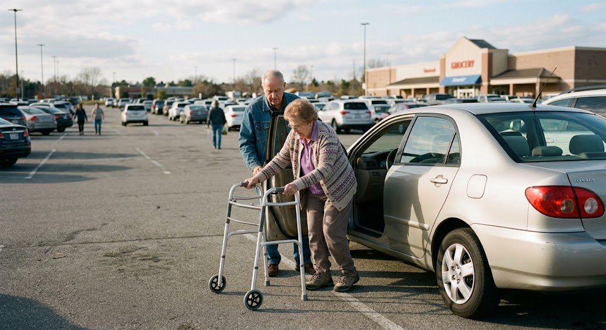

# Driving, the DMV, and placards

**Fitness to drive.** North Carolina has no statute requiring physicians to report unsafe drivers, but it does allow it: physicians, family members, law enforcement, and license examiners may all request a re-examination through the [NCDMV Medical Review Program](https://www.ncdot.gov/dmv/license-id/license-suspension/medical-review-program/Pages/default.aspx). Requests must be in writing and **cannot be anonymous** — the patient will find out it was you, so have the conversation first. Once a driver is in the program, DMV mails a packet; the physician’s portion is the [DL-78](https://www.ncdot.gov/dmv/downloads/Documents/DL-78.pdf). The decision belongs to DMV’s Medical Review Unit, not to you, and there’s an appeal process. Whatever you decide, document the counseling — “advised not to drive; patient verbalized understanding; daughter present” — because that note is the one that matters if there’s a crash.

**Special notes on dementia.**This is the most common scenario where the family and the DMV will look to you to decide when it's time for your patient to stop driving. If you based you judgment solely on periodic 20-minute appointments, that's a very difficulty task, one with important consequences.

Fortunately, you are not the first to wrestle with this issue. This is a well-worn path, with plenty of guidelines and tools to help you. These types of visits really can not be done in a routine 20 minute visit.

To start with, the American Academy of Neurology has guidelines: [Practice Parameter update: Evaluation and management of driving risk in dementia](https://www.aan.com/globals/axon/assets/7091.pdf). They recommend against using a simple Mini Mental Status Exam, and instead favor the [Clinical Dementia Rating (CDR)]([https://knightadrc.wustl.edu/app/uploads/2021/10/English-New-Zealand.pdf) scale. This is a ten-page form, most is filled out by someone close to the patient, and a few pages you fill out by quizzing your patient.

Scoring the CDR is not simple. There are six domains, rendering this into bite-sized pieces giving you six separate values raning 0 to 3. Then you have to calculate the global CDR score. This is where the [CDR® Global Score Calculator](https://www.naccdata.org/calculators/) comes in.

The CDR score correlates with the chance of passing an open road testing, but is not the sole decision point about a driver's abilities. Other factors, as outlined in the guidelines, have to be considered as well.

The upshot is you have to answer this question: *Do you feel the patient is medically fit to drive a car? Yes or no*.

If you have the slightest hesitation about this person's safety on the road or simply need more information, the answer is "no". That would be your *opinion*, not a final decision. If you reply "no" you can still recommend that the person have a road test, whiach performed by a variety of independent evaluators such as [Driver Rehabilitation Services](https://www.driver-rehab.com), and/or be evaluated by an occupational therapist. The final decision about the privilege to drive rests with the DMV.

**Placards.** These are quick and low-stakes, and patients love you for them. In North Carolina it’s form [MVR-37A](https://www.ncdot.gov/dmv/downloads/Documents/MVR-37A.pdf) for a placard ([MVR-37](https://www.ncdot.gov/dmv/downloads/Documents/MVR-37.pdf) for the plate), signed by a physician, PA, or NP. A permanent placard runs five years and requires recertification to renew, though people 80 and older are exempt from recertification at renewal. A temporary placard is good for up to six months and cannot be renewed — so if the disability is permanent, don’t check “temporary” out of habit. The qualifying criteria are statutory (G.S. 20-37.5), and the usual one is inability to walk 200 feet without rest.
