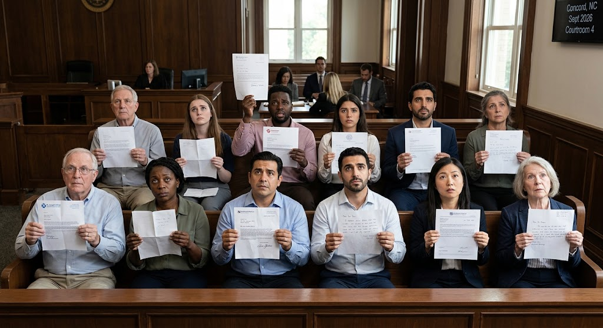

# Jury duty excuses

For some reason, many people don’t want to do jury duty. It’s tedious and requires paying attention for a couple of hours at a stretch, possibly several days running. In practice a large panel is summoned for a twelve-member jury, and most people who aren’t seated go home after a few hours.

### North Carolinas Laws and Procedures

In North Carolina, anyone may request to be excused, deferred, or exempted in writing, by filling out and submitting form [AOC-G-400](https://www.nccourts.gov/assets/documents/forms/g400_1.pdf), at least five days before the summons date (read the statute: [G.S. 9-6.1](https://www.ncleg.gov/enactedlegislation/statutes/pdf/bysection/chapter_9/gs_9-6.1.pdf)). Note that in the North Carolina statutes, **a doctor's note is not explicitly required**. But a few NC *counties* do indeed require it. Jury excuse procedures for each county may be found [online](www.nccourts.gov/help-topics/jury-service/jury-service), where the AOC-G-400 can be submitted online for some counties.

You might save yourself some paperwork by having your staff suggest to your patient that they fill out for AOC-G-400 online, and then ask for a letter from you only if denied.

Note that **simply being 72 years of age or older is grounds for an excuse** from jury duty. Patients often don’t notice this provision at all. But it isn’t automatic — the judge may allow or deny it — and it isn’t purely age-based, so a letter from you still helps.

### Federal Jury Duty

Federal jury service is a separate system with [its own rules](https://www.ncmd.uscourts.gov/information-jurors); for the Middle District of North Carolina, age over 70 is among the grounds for an excuse request.

### What to Write

Anything that might interfere with attention is a valid basis, including medication side effects (it’s hard to be a good juror on furosemide when your attention is on your bladder). Your letter must state the medical reasons and whether the problem is *temporary* — and if so, for how long — or *permanent*. Any protected health information in the letter remains confidential.

Here’s my template:

> *To whom it may concern,*
>
> *I am the primary care physician for Mr. John Jones who has been a patient at our medical office for quite some time. I am well-versed in his various medical issues. Mr. Jones has recently been summoned for jury duty.*
>
> *Serving on a jury is fundamental to our democracy, and those who are capable of serving should do so, and as such I write this letter only after thoughtful consideration of Mr. Jones’ health status.*
>
> *After reviewing his medical records thoroughly, it is evident that Mr. Jones has medical issues, or is prescribed medications to treat such medical issues, that impair his ability to be attentive for long periods of time as jury duty requires. Therefore, I believe it would be in the best interests of Mr. Jones’ health, and in the best interests of the citizens of North Carolina, that he be excused from jury duty as requested by his recent summons.*
>
> *The primary underlying medical issue precluding Mr. Jones’ from serving effectively is chronic lower back pain precluding his ability to sit without distracting pain for more than a few minutes. This problem is chronic, I do not expect it to improve, and it should therefore be considered permanent.*
>
> *Should you need more details, I would be happy to supply them, in according with HIPAA regulations.*
