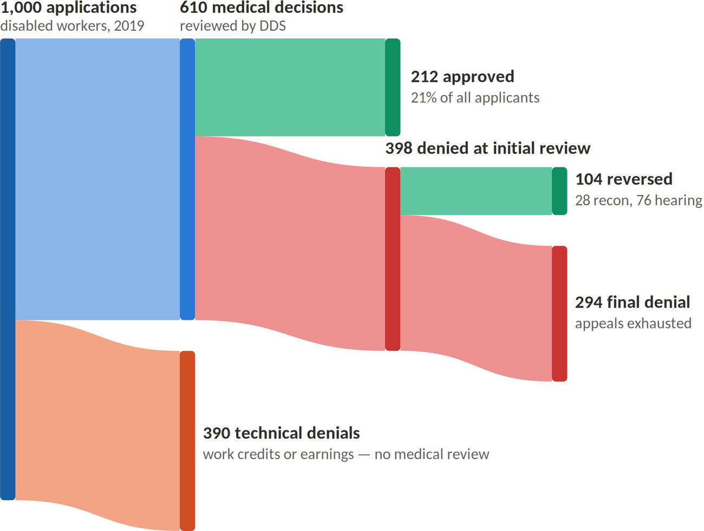

# Social Security disability

You don’t get to decide whether Social Security should award benefits, and no one will ask you to. That determination is made by the state Disability Determination Services, using your records as evidence, with their own medical consultants and, if needed, a consultative examination by an independent physician. Your patient may ask you to “vouch” for them; the honest answer is that your opinion is not the deciding factor.

That said, “you have no responsibility” overstates it in three ways:

- **You will receive records requests** authorized by the patient’s signed SSA-827. The records department will handle this. DDS pays a modest fee. Slow or incomplete responses genuinely hurt claims.
- **You may be asked to complete a medical source statement.** It’s optional. Note that for claims filed on or after March 27, 2017, SSA no longer gives treating physicians’ opinions controlling weight — opinions are weighed on *supportability* and *consistency* with the record. Practically, that means a one-paragraph “my patient is disabled” letter accomplishes almost nothing, while years of office notes documenting specific, objectively supported functional limits accomplish quite a lot. The chart is the advocacy.
- **You may be asked to perform the consultative exam yourself.** DDS prefers the treating source and pays a fee. You may decline.

Some things worth telling the patient: First, have them pull their Social Security statement at https://www.ssa.gov/myaccount — people are often shocked at how small the disability benefit is, since it depends on what they’ve paid in. (Check yours while you’re at it.)

Second, they should also understand which program they're actually applying for. Social Security Disability Insurance (SSDI) is an earned insurance benefit: eligibility comes from work credits, the monthly amount depends on lifetime earnings, cash benefits don't begin until the sixth full month after the established onset date, and Medicare doesn't start until 24 months after that. Supplemental Security Income (SSI) is a needs-based program with strict income and asset limits. It pays a flat federal maximum — lower than the average SSDI benefit — but it has no five-month waiting period, payments can begin the month after application, and in most states Medicaid comes with it right away. Patients with a thin or interrupted work history often qualify only for SSI, and patients with low lifetime earnings can end up with an SSDI benefit below the SSI maximum, in which case they may receive both.

Confused? Here’s a comparison. You DON’T need to know this stuff.

|                 | SSDI                                                          | SSI                                                           |
|-----------------|---------------------------------------------------------------|---------------------------------------------------------------|
| What it is      | An earned insurance benefit                                   | A needs-based welfare benefit                                 |
| Eligibility     | Work credits from payroll taxes — you paid in                 | Income and assets below strict limits; no work history needed |
| Payment amount  | Based on lifetime earnings, varies by person                  | Flat federal maximum, reduced by other income                 |
| Cash starts     | Sixth full month after the established onset date             | Month after application                                       |
| Health coverage | Medicare, 24 months after cash benefits begin                 | Medicaid, usually immediately in most states                  |
| Also covers     | Disabled workers, some disabled adult children and widow(er)s | Aged 65+, blind, and disabled adults and children             |

Third, if they are awarded benefits, get a copy of the award letter scanned into the chart. I regularly have government agencies asking me in writing whether a patient has been awarded disability by, you know, the same government that awarded it.

Fourth, about 65% applications for permanent disability based on medical reasons are denied on the first attempt. Of those initially denied 52% are later overturned with the help of an attorney. See below:

The times frame for approval can be six months if all goes well, or more than two years if appeals are required. Again, the insurance coverage (Medicare) won’t start for two more years.
